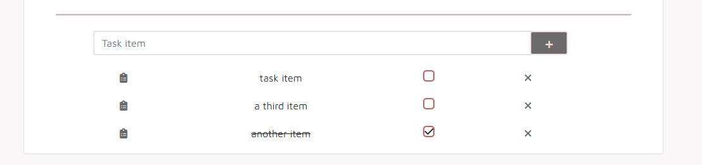
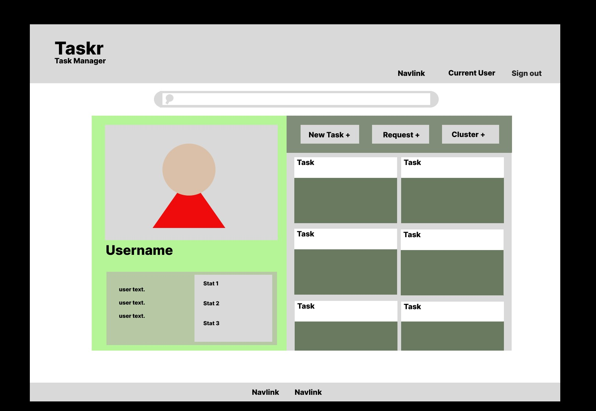
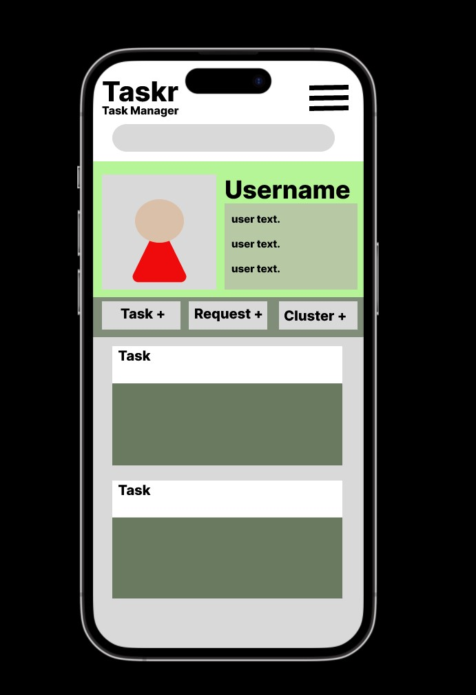

# taskr - [Live Link](https://taskr-react.herokuapp.com/)

 

## _"taskr is a quick and easy to use task manager. It helps you keep track of your important tasks and lets you request tasks from your friends!"_

 

### taskr strives to make tasking both simple and fun. The intuitive UI created using React.JS makes for a comprehensible and effortless experience. Future updates will increase functionality and complexity by adding user-created "task clusters" where multiple users can collaborate and task together, and making taskr an effective tool for complex task assignments and workflow.

 

## Project goals

The main goal of this project is to use React.JS to create a functional frontend web application and corresponding database API for managing my personal tasks. Furthermore it needs to be intuitive and simple and the platform should make implementing future features easy. The scope of this project has been narrowed significantly to fit the project timeline.

Necessary core functionality:

- Authentication
- Tasks (CRUD)
- Clusters (CRUD)
- User Profiles
- Searchbars and filtering
- Good UX Design

 

## Features

 

### _UX Design_

This project is developed with a UX-first approach where I have used my self as the target audience. My goal is to create an experience that is overall so effortless that even a lazy person like myself will opt for using it when given the choice. Through the development it has been important to consider how to avoid rendering to much information at any given time in order to keep an understated aesthetic.

 

### _Custom styling_

taskr uses custom CSS styling along with react bootstrap to create a minimalist, pastel-themed UI that remains recognizable despite being fairly simplistic.

 

### _Responsive design_

taskr has been developed and tested for use with both larger screens as well as tablets or phones. In order to ensure a ubiquitous and consistent experience regardless of what device the end user is utilizing.

 

### _User Features_

**Navbar:**  
 To avoid cluttering the screen and distracting the user from their tasks the navbar has a minimalist appearence and offers only navigation to the home (profile) page and authentication. All other navigation occurs intuitively via other user features.  
 

**Authentication:**  
 In order to use taskr, a user must sign-up using a free account. This will automatically generate a profile for all registered users and allows them to access taskr anywhere. Registration is kept simple and requires only a valid username and password. In future updates verification may become necessary in order to provide users with a "forgot password?" option.  

**Profile:**  
 Once authentication is completed by the user the main page becomes the users profile, from which all authenticated navigation takes place. This is done to avoid needless navigation between different pages. The profile features a section where the user can choose to display personal info (currently name, a short biography, and a profile picture. This will likely be extended with more optional content in future updates), an area displaying relevant statistical information about the user account (currently only the users number of "active tasks". This will also be expanded in future updates).

**Task/Request:**  
 The primary feature of taskr is to create and manage tasks, as well as send task requests to other users, which if they accept, gives them ownership of the task. Tasks/requests are accessed through communication with the database via a custom REST API (created in Django Rest). The user have several options to consider when creating tasks, each of which are displayed when relevant. An authenticated user can easily edit a task/request (for which they are the owner) at any time.

**Task Items:**  
Each individual task can be supplied with an optional amount of Task Items (by the task owner). That will appear as a list with new items being rendered below the previous one. The task items can be checked once they are completed, which will automatically move them to the bottom of the item list. This makes taskr useful for managing more complex tasks or things like shoppinglists.  

**Task/Request tabs:**  
Logged in users will have access to two tabs directly underneath their profile information which when clicked on determine if either the currents profiles affilated tasks or requests are to be displayed (a third tab will be added for "Clusters" in a future update). Using a combination of back end filtering and conditional rendering in React different tasks/requests are displayed (using the same components) depending on whether or not the user is viewing their own profile or the profile of another user. This makes finding tasks/requests quick and comprehensible.  

**Searchbars:**  
 There are two searchbars at the users disposible. The first is a user searchbar, which allows a logged in user to find other registered user by typing (a partial) name or username in the search field. Upon clicking on a search results the user navigates to said users profile. Each profile also contains a task/request searchbar which, similarly, allows the user to search for specific tasks/requests belonging to the current profile and/or authenticated user.

**Lists:**  
Each aformentioned tab contains a list displaying an overview of each relevant task/request. These preview lists are ordered by due date and whether or not they are complete. This allows the user to obtain an overview of the most urgent tasks at a glance. Each item on the list is collapsable to only its header, giving the user an adjustable overview of the tasks/requests. The lists use the "React-Infinite-scroll" component in place of traditional pagination.This is done to make the UX more seemless.  

**Detail Views:**  
taskr provides users with detailed view pages for browsing individual tasks or creating/editing a task. This allows the user to focus entirely on the task at hand (pun intended) without being distracted by other less relevant information.

 

### Future Features and Implementations

**Clusters:**  
The largest forseeble update to taskr will include allowing for the creation of Task Clusters. A cluster will allow a user to create and manage lots of tasks and requests across multiple user under a single "cluster". By inviting a user to the cluster the user can now view/manage tasks within that cluster (if the cluster owner permits the user). Individual tasks can also be assigned to individual users so that only they can update/complete the task. The functionality provided by clusters would make taskr very useful in real-world workplace situations. It was not included in the scope of this project as it requires **a lot** of time.

**Permanent records:**  
Another small feature to include in future updates is a permanent record of all tasks. Currently, when a task is deleted, it is completely removed from the database. A more preferable approach to managing old data would be to removed the user content but keep file statistics such as: when it was created, when it was completed, and who completed it. This is not currently included as it is not a priority nor a core function of the app.

**Attach files to tasks:**  
In a smaller future update, taskr will allow users to attach files such as jpg's and pdf's as task items. This would make taskr more useful as it would eliminate the need for users to resort to other means to provide eachother with docs. This has not been included so far as it is not part of taskrs core functionality.

**Follow sers:**
A future update would allow a user to follow other users. This will become an important feature once "clusters" are available, and will also provide relevant statistics for further future updates.

 

## Development

 

### _Agile Tools_

#### **User Stories:**

The project utilizes user stories as a method of development. The user stories are categorized into EPICs and provided with MoSCoW prioritization. Developing using user stories ensure that no unnecessary coding is done that wont be include in the production version of the project. All user stories are mapped below:

- Authentication:

  - (M) As a first time user, I can create a user account, so that I can log in to taskr.
  - (M) As a registered user, I can sign in to my account, so that I can access my account privelages.
  - (M) As a site user, I can view my logged in status in the navbar, so that can see if I am logged in.
  - (M) As a site user, I can remain signed in until I choose to sign out, so that I don't have to sign in everytime I open the webpage on the same device.

- Design (UX):

  - (M) As a first time site user, I can read about taskr's purpose on the homepage, so that I can quickly learn what I need about taskr.
  - (M) As a signed in user, I can view my profile page, so that I can view all my relevant tasks.
  - (M) As a signed in user, I can view completed and uncompleted tasks in seperate fields, ordered by due date and priority, so that I can easily identify which task I should do next.
  - (S) As a signed in user, I can view notifications via the navbar, so that I get a notifications when one of my cluster memberships changes, or I have a new task request.

- User Profiles:

  - (S) As a registered user, I can choose to add personal information and a profile image, so that \*I can choose what personal information i want to display to other users.
  - (C) As a signed in user, I can see basic statistics about my tasks on my profile page, so that I can get an overview of how I'm doing.

- Tasks:
  - (M) As a signed in user, I can click a button in my profile page, so that I can add a new task.
  - (M) As a signed in user, I can tick a box for a task, so that I change the task status to "completed".
  - (S) As a site user, I can choose if a task has a high or low priority, so that my prioritzed tasks stand out.
  - (M) As a site user, I can set a due date for a task, so that I can view my tasks in order of urgency.
  - (S) As a site user, I can add task items to a task, so that I can tick of individual items for each task as I progress.
  - (M) As a site user, I can I can type a text description for my task, so that I can remind my self about the task requirements.
  - (M) As a site user, I can click on a tasks edit button, so that I can make changes to my task.
  - (M) As a site user, I can click a button to delete a task, so that it is gone forever.
  - (M) As a site user, I can _choose between a tasks visibility being "public" or "private", _, so that I can set personal tasks that only I can see.
  - (M) As a site user, I can _choose between a tasks visibility being "public" or "private", _, so that I can set personal tasks that only I can see.
  - (M) As a task request recipient, I can click "Accept" or "Reject", so that I can choose whether or not to accept a task.
  - (C) As a site user, I can tick all the items of a task, so that the task automatically completes.
    -(C) As a site user, I can see a progress bar for a task, so that i am aware of what percentage of the task is completed.
  - (C) As a site user, I can comment on another users task, so that I can easily communicate relevant information about the task.
- Searchbars and filtering:

  - (M) As a registered user, I can type the name of a task into a searchbar, so that I quickly can find specific tasks.
  - (M) As a signed in user, I can type in a username into a search bar, so that I can click to view that users profile.
  - (M) As a signed in user, I can type a task name into a search bar, so that I can filter through my tasks by name and display only relevant tasks.
  - (S) As a site user, I can search for a specific cluster by name, so that only tasks for the specified cluster are displayed.
  - (C) As a site user, I can click on an ordering option in my search results area, so that my search query tasks are displayed in the order I want.

- Clusters:
  - (S) As a site user, I can assign a task to a custom "cluster", so that I can group my tasks together.
  - (C) As a site user, I can assign a color to a custom cluster, so that my clusters are color-coded.
  - (S) As a cluster creator, I can add users to my cluster, so that I can choose who gets access to the cluster.
  - (S) As a cluster owner, I can assign tasks individually, so that I can distribute the tasks amongst the task members as I see fit.
  - (C) As a cluster owner, I can make another user "owner", so that they are also able to distribute tasks or add members.
  - (S) As a cluster member, I can click a button to leave a cluster, so that I am no longer a member of that cluster.

#### **Kanban Board:**

The Project utilizes Githubs Kanban board via the "projects" tab. The board is used to track the current progress of the projects user stories. So far 23 out of 35 user stories have been completed. See the Kanban [here](https://github.com/fabianlien/taskr/projects/1).

 

### _Frontend_

#### **Wire Frames:**

**Desktop screen**: An initial wire frame mock-up was created for a desktop layout. Initially I thought utilizing the extra width on the desktop screen to display profile information would make for a better user experience, but I soon changed my mind as I realised that forcing the user to keep viewing the profile data would potentially distract them from the primary function of the main page: viewing the tasks. Other changes were made in favor of a less clutered UI and a second search bar was added to make the search UX more comprehensible. The layout in the final version for this project differs quite a bit and was changed in favor of a more conventional layout and is much closer to the wireframe layout for the mobile version. See below:

_Desktop wireframe:_  

_Mobile wireframe:_  

 

#### **Key Front-end Technologies**

- **React.js:** The primary Front-End library used for this project is React. For those not familiar, React is a open-source Javascript library created by Meta (formerly Facebook) and is used to create Frontend web UI's which integrate javascript logic. It utilizes a modified version of JavaScript called JSX (which is sort of a mash-up of html and JS). React has become vastly popular over the passed few years, in large part because it lends itself to recycling code. This is primarily achieved through the use of "components".

  React components are easily nested within one another and use props to pass data down the component ancestry. In this project, for example, The same "TaskPreview.js" and consequently "Task.js" components are rendered within both "RequestList.js" and "Tasklist.js" and use conditional logic to determine what data to request from the API and how to filter said data. In a future update, the same Task.js will be reused to render task data to the dom within a task "Cluster".

  Components use state to render information to the DOM, thus allowing for individual components to refresh independently (without requiring a full page refresh). This is becomes evidently useful when for instance a user is searching for a task or another user and the results are imediately filtered as fetch requests are sent continously with each cahnge to the state of the searchbar component which is then rerendered to display the most current results.

  As React by default only concerns itself with managing state aditional packages/libraries are needed to provide client-side functionality.

- **React Router:** The React Router package (together with React Router DOM) allows for http routing between different pages in the web app.

- **Axios:** Used for HTTP requests. Intercepts requests and responses and automatically converts datapackages to/from JSON format.

- **React Bootstrap 1.6:** Used for quick consistent styling and grid layout with built in class components.

- **React Infinite Scroll Component:** Used to display lists of tasks or requests without requiring the user to change page using default pagination, thus making for a more "modern" UX.

- **JWT Decode:** Used for decoding the encoded web tokens validated by the server.

- **React Datepicker:** Reusable component that allows the user to set and change due dates for tasks/requests.

- **React Custom Checkbox:** A customizable checkbox component that looks much better than the default browser checkbox or the Bootstrap checkbox.

 

### _Backend_

As a part of this project a custom API was created using Django's REST framework. The API uses custom database models in combination with views and serializers to manage requests from the front-end. A PostgreSQL database has been set up for use with the deployed API and React app. A link to the REST API Repository can be found [here](https://github.com/fabianlien/taskr-api).

 

## Manual Testing

### Navigation:

| Test                        | Action                                                           | Expected Result                                                                                                               | Pass |
| ------------------------    | ---------------------------------------------------------------- | ----------------------------------------------------------------------------------------------------------------------------- | ---- |
| Site logo                   | Click the "taskr" logo                                           | Route to the homepage                                                                                                         | ✓    |
| Sign in navbar              | Click the "Sign in" link                                         | Route to the "sign in" page                                                                                                   | ✓    |
| Link: Not Registered Yet?   | Click the "Not registered..." link                               | Route to the "sign up" page                                                                                                   | ✓    |
| Sign up navbar              | Click the "Sign up" link                                         | Route to the "sign up" page                                                                                                   | ✓    |
| Link: Already Have...?      | Click the "Already have an account... " link                     | Route to the "sign in" page                                                                                                   | ✓    |
| Sign out navbar             | While authenticated Click the "Log out" link                     | Log out the current user and route to home page                                                                               | ✓    |
| User profile search         | Click on a result after typing a query in the user search bar    | Route to the relevant user profile                                                                                            | ✓    |
| Edit profile icon           | Click the "edit" icon on the profile page                        | Route to the authenticated users "edit profile" page                                                                          | ✓    |
| Save/Cancel profile button  | Click the "Save" or "Cancel" button from the edit profile page   | Route back to the user profile                                                                                                | ✓    |
| "Go back" task icon         | Click the "go back" icon in a task page                          | Route back to the user previous page                                                                                          | ✓    |
| "+ Task"/"+ Request" button | Click the "+ Task" or "+ Request" button                         | Route to the "Create Task" or "Create Request" pages                                                                          | ✓    |
| Add+/Cancel task button     | Click the "+ Add" or "Cancel" button from the Task/Request page  | Route back to the relevant user profile                                                                                       | ✓    |
| Task preview body           | Click a preview task/request                                     | Route to relevant task/request detail page                                                                                    | ✓    |
| Request user profile link   | Click the "username" link inside a request detail page           | Route to the relevant user profile                                                                                            | ✓    |

### Features:

| Test                      | Action                                | Expected Result                                                                                                                                            | Pass |
| ------------------------- | ------------------------------------- | ---------------------------------------------------------------------------------------------------------------------------------------------------------- | ---- |
| Create task               | Submit a valid task form              | Reroute to authenticated user profile with updated task preview list                                                                                       | ✓    |
| Create request            | Submit a valid request form           | Reroute to relevant user profile with updated request preview list                                                                                         | ✓    |
| Edit task                 | Submit a valid edit task form         | Reroute to authenticated user profile with updated task preview list                                                                                       | ✓    |
| Delete task               | Click the "delete" button in task page| Reroute to authenticated user profile with updated task preview list                                                                                       | ✓    |
| Current user task list    | Render the authenticated user profile | A list of task previews should be generated showing up in order of task due date and completed state, with more tasks loading as the user scrolls down     | ✓    |
| Current user request list | Render the authenticated user profile | A list of request previews should be generated in "ingoing" and "outgoing" rows. Ordered by due date, with more tasks loading as the user scrolls down     | ✓    |
| Non-auth user task list   | Render another users profile page     | A list of task previews should be generated in order of task due date and completed state, without private tasks displaying, uses infinite scroll          | ✓    |
| Non-auth user request list| Render another users profile page     | A list of the non-accepted requests the user has send to the user should appear, with more tasks loading as the user scrolls down                          | ✓    |
| User search bar           | Type an input into the user search bar| After a timeout, a list with usernames or names containing the search query appear, else a "no results" message                                            | ✓    |
| Task/Request search bar   | Type an input into the user search bar| After a timeout, a list with tasks / requests containing the search query appear, else a "no results" message                                              | ✓    |
| Active tasks display      | View a user profile                   | An integer is shown representing the number of active tasks for the current user                                                                           | ✓    |
| Accept request            | Click the "Accept" button in a request| Change state and color of the request with updated "active tasks" number on user profile and request moved to "My tasks" tabs                              | ✓    |
| Reject request            | Click the "Reject" button in a request| Reroute to authenticated user profile with updated "incoming requests" preview list                                                                        | ✓    |
| Edit profile page         | Submit a valid edit profile form      | Profile picture and bio should change according to new input data                                                                                          | ✓    |

### Validation:

| Test           | Action                       | Expected Result                                                                                                                         | Pass |
| -------------- | ---------------------------- | --------------------------------------------------------------------------------------------------------------------------------------- | ---- |
| Sign in form   | Submit a valid form          | The user is rerouted to their profile page                                                                                              | ✓    |
| Sign in form   | Submit an invalid form       | the submitted form registers a 400 error with the console and input error message appears underneath the corresponding field            | ✓    |
| Sign up form   | Submit a valid form          | The user is rerouted to log in page and can log in with new crednetials                                                                 | ✓    |
| Sign up form   | Submit an invalid form       | the submitted form registers a 400 error with the console and input error message appears underneath the corresponding field            | ✓    |
| Sign out link  | Click the sign out link      | the user is redirected to the landing page and cannot access pages that require authentication                                          | ✓    |
| Create task    | Submit an invalid task form  | the submitted form registers a 400 error with the console and input error message appears underneath the corresponding field            | ✓    |
| Create request | Submit an invalid task form  | the submitted form registers a 400 error with the console and input error message appears underneath the corresponding field            | ✓    |
| Edit task      | Submit an invalid task form  | the submitted form registers a 400 error with the console and input error message appears underneath the corresponding field            | ✓    |
| Edit profile   | Submit an invalid task form  | the submitted form registers a 400 error with the console and input error message appears underneath the corresponding field            | ✓    |

### Error Handling:

| Test | Action                           | Expected Result                                                                          | Pass |
| ---- | -------------------------------- | ---------------------------------------------------------------------------------------- | ---- |
| 404  | Navigate to a nonexisting URL    | If page does not exist, display custom 404 page.                                         | ✓    |
| 404  | Non-existent profile ID in URL   | Reroute to homepage.                                                                     | ✓    |
| 404  | Non-existent task ID in URL      | Reroute to homepage.                                                                     | ✓    |

### Unresolved Issues/Bugs:

 

## Deployment

### **Development Build:**

1.  Clone [this repository](https://github.com/fabianlien/taskr).
2.  Open your IDE and connect to your repo, then enter this command in the terminal:

        npm install

3.  Make sure your package.json dependencies look like this:

    "dependencies": {
    "@testing-library/jest-dom": "^5.16.4",
    "@testing-library/react": "^11.2.7",
    "@testing-library/user-event": "^12.8.3",
    "axios": "^0.21.4",
    "bootstrap": "^5.2.3",
    "jwt-decode": "^3.1.2",
    "react": "^17.0.2",
    "react-bootstrap": "^1.6.1",
    "react-custom-checkbox": "^3.1.4",
    "react-datepicker": "^4.8.0",
    "react-dom": "^17.0.2",
    "react-infinite-scroll-component": "^6.1.0",
    "react-router-dom": "^6.6.2",
    "react-scripts": "^4.0.3",
    "web-vitals": "^1.1.2"

4.  Add your personal url for the deployed DRF API in the axiosDefaults.js file (as baseURL).
5.  Git add, commit and push all changes to your repo.
6.  Create or log in to an account on Heroku.
7.  Create a new app on Heroku.
8.  In the Deploy section on Heroku, go to Deployment method and add your GitHub repository.
9.  Go down to Manual deploy and select deploy branch for early deployment.

 

### **Production Build:**

1.  To create a production build, enter this command in your terminal:

        npm run build

2.  Git add, commit and push to your repo.
3.  In the Deploy section on Heroku, go to Manual deploy and select deploy branch.
4.  Go to the Settings tab and scroll down to Domains where you find the URL to your deployed site.

## Credits
